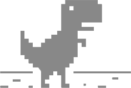

  

# Juego Dinosaurio

  El famoso juego del dinosaurio del Google Chrome.

## ¿Qué es _el juego del dinosaurio_?
Todos hemos estado sin internet, es en esos momentos cuando aparece el legendario juego del dinosaurio a salvarnos, un juego muy simple y que está disponible sin conexión a internet.

## ¿Dónde puedo jugarlo?
Puedes probar la versión web [aquí](https://marfullsen.github.io/PR-Juego-Dinosaurio/).

## ¿Cuál es el fin de este proyecto?
Este proyecto se creó con fines de aprendizaje del lenguaje de progración JavaScript y un video de YouTube de Gemuki Dev llamado [Aprende a hacer el DINOSAURIO de Chrome en 10 minutos](https://www.youtube.com/watch?v=5gVOlPLz7Hk)

## ¿Cómo puedo contribuir?
Todas las contribuciones son bienvenidas, se recomienda usar [_pull requests_](https://github.com/Marfullsen/PR-Juego-Dinosaurio/pulls).

## Capturas de pantalla

  

## Referencias

- [Forkeado del repo de Carlos Orellana](https://github.com/CarlosOrellana00/Juego-Dinosaurio)
- [Video-tutorial "Aprende a hacer el DINOSAURIO de Chrome en 10 minutos con JavaScript" en YouTube por "Gemuki Dev"](https://www.youtube.com/watch?v=5gVOlPLz7Hk)